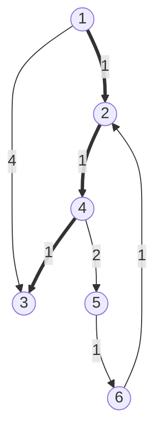

```c++
/*
Copyright 2018 Pierre-Edouard Portier
peportier.me

Licensed under the Apache License, Version 2.0 (the "License");
you may not use this file except in compliance with the License.
You may obtain a copy of the License at

    http://www.apache.org/licenses/LICENSE-2.0

Unless required by applicable law or agreed to in writing, software
distributed under the License is distributed on an "AS IS" BASIS,
WITHOUT WARRANTIES OR CONDITIONS OF ANY KIND, either express or implied.
See the License for the specific language governing permissions and
limitations under the License.
)
*/

```
# Plus court chemin sur un graphe aux arêtes étiquetées positivement (Dijkstra)

Répertoire GitHub correspondant à cet article : https://github.com/peportier/ia04-dijkstra

## Principe de l'algorithme

Nous considérons un graphe dont chaque arête est étiquetée avec un nombre positif ou nul. Il s'agit de calculer pour chaque nœud du graphe sa plus courte distance à un nœud $v$ fixé. La plus courte distance entre deux nœuds est la longueur du plus court chemin entre ces deux nœuds.

L'ensemble des nœuds noirs est l'ensemble des nœuds pour lesquels la plus courte distance à $v$ a été établie. Un plus court chemin ne visite que des nœuds noirs.

L'ensemble des nœuds gris est l'ensemble des nœuds pour lesquels la longueur d'un chemin y menant depuis $v$ a été trouvée, mais cette longueur n'est pas nécessairement minimale. Par contre, c'est la longueur minimale parmi l'ensemble des longueurs des chemins qui n'ont que des nœuds noirs entre $v$ et ce nœud gris.

Au sujet des nœuds blancs, nous ne savons rien... sinon que tout chemin considéré depuis $v$ jusqu'à un nœud blanc doit d'abord passer par un nœud gris.

On note $d[u]$ la distance associée à un nœud noir ou gris. C'est la longueur du chemin le plus court actuellement connu pour rejoindre $u$ à partir de $v$. Ce dernier chemin n'est donc fait que de nœuds noirs.

Comment choisir le prochain nœud gris qui deviendra noir ?

Nous montrons que nous pouvons choisir un nœud gris $u$ qui minimise $d[u]$.

Considérons un chemin _quelconque_ de $v$ à $u$ et notons sa longueur $l$. Ce chemin peut contenir d'autres nœuds gris et même des nœuds blancs. Puisque $v$ est noir et que $u$ est gris, à un moment donné ce chemin quitte la région noire. Soit $g$ le premier nœud non-noir (c-à-d gris) de ce chemin. $g$ peut être égal à $u$ ou ne pas être égal à $u$. Puisque $u$ a été choisi pour minimiser $d[u]$, nous avons : $d[u] \leq d[g]$. Puisque la distance de $g$ à $u$ est positive ou nulle, nous avons : $d[g] \leq l$. Donc $d[u] \leq l$. Donc ce chemin est au moins aussi long que celui dont la découverte avait mené à la mémorisation de la valeur actuelle $d[u]$. Donc la longueur du plus court chemin de $v$ à $u$ est $d[u]$, et le nœud $u$ devient noir.

Tous les successeurs blancs de $u$ sont colorés en gris, et une distance est mémorisée pour chacun d'entre eux, faite de la plus courte distance de $v$ à $u$ ($d[u]$ ) à laquelle on ajoute la distance de $u$ à ce successeur.

Tous les successeurs gris de $u$ restent gris, mais la distance qui leur est associée peut être réduite (si le chemin qui passe par $u$ est plus court).

Pour les successeurs noirs de $u$, il n'y a rien à faire.
$$
\begin{aligned}
&x \gets \emptyset \\
&y \gets \{v\} \\
&d[v] \gets 0 \\
&\textbf{while } y \neq \emptyset \textbf{ do} \\
&\quad \text{⍝ choose $u$ such that } u \in y \; \wedge \; \left( \forall z : z\in y : d[u] \leq d[z] \right)\\
&\quad x \gets x \cup \{u\}\\
&\quad y \gets y \backslash \{u\} \\
&\quad \textbf{for } n : n \in s(u) \textbf{ do} \\
&\quad\quad \textbf{if } n \in x \textbf{ then } skip \\
&\quad\quad \textbf{else if } n \in y \textbf{ then } d[n] \gets min \left( d[n] , d[u] + len(u,n) \right) \\
&\quad\quad \textbf{else ⍝ } n \notin (x \cup y) \\
&\quad\quad\quad y \gets y \cup \{n\} \\
&\quad\quad\quad d[n] \gets d[u] + len(u,n) \\
&\quad\quad \textbf{end if} \\
&\quad \textbf{end for} \\
&\textbf{end while}
\end{aligned}
$$

## Implémentation

La liste d'adjacence d'un noeud contient maintenant les poids des arêtes qui permettent d'atteindre les voisins de ce noeud

```c++
#include <iostream>
#include <vector>
#include <set>
#include <queue>
#include <map>
#include <list>
#include <functional>
#include <utility>
#include <limits>

using namespace std;

struct
node
{
  int val;
  vector< pair< int, node* > > nei;
  node() {};
  node(int i) : val(i) {}
};

```

L'implémentation de l'algorithme suit d'assez près le pseudo-code de notre dérivation. La différence principale réside dans l'utilisation d'une file de priorité, et dans le maintien d'une structure `map< node*, node* > parent` qui permet de reconstruire le chemin une fois la destination atteinte.

```c++
void
dijkstra( node* src, node* target, list<node*>& path )
{
  map< node*, node* > parent;
  parent[src] = src;

  map< node*, int> d;
  d[src] = 0;

  set<node*> x;

  priority_queue< pair< int, node* > ,
                  vector< pair< int, node* > >,
                  greater< pair< int, node* > > > y;

  y.push({0, src});

  function<int(node*)>
  dist = [&]( node* v )
  {
    map< node*, int >::const_iterator it = d.find(v);
    if( d.end() == it )
    {
      return numeric_limits<int>::max();
    }
    return it->second;
  };

  while( !y.empty() )
  {
    node* u = y.top().second;

    if( target == u ) // once the target is found, we rebuild the path to it
    {
      path.clear();
      while( u != src )
      {
        path.push_front(u);
        u = parent[u];
      }
      path.push_front(src);
      return;
    }

    y.pop(); x.insert(u);  // u, the 'smallest' grey node, becomes black

    for( pair< int, node* >& n : u->nei )
    {
      if( x.end() != x.find(n.second) ) continue; // if n is black, do nothing...

      // We don't make a special case for n already an element of y.
      // Indeed, the STL priority queue doesn't have an increaseKey operation.
      // Therefore, we tolerate duplicates.

      if( dist(n.second) > d[u] + n.first )
      {
        d[n.second] = d[u] + n.first;
        parent[n.second] = u;
        y.push( { d[n.second], n.second } );
      }
    }
  }
}
```

Nous testons l'algorithme sur un exemple de graphe étiqueté positivement.

```c++
int
main()
{
  node n1(1); node n2(2); node n3(3);
  node n4(4); node n5(5); node n6(6);
  n1.nei.push_back( { 1, &n2 } );
  n1.nei.push_back( { 4, &n3 } );
  n2.nei.push_back( { 1, &n4 } );
  n2.nei.push_back( { 2, &n5 } );
  n4.nei.push_back( { 1, &n3 } );
  n4.nei.push_back( { 2, &n5 } );
  n5.nei.push_back( { 1, &n6 } );
  n6.nei.push_back( { 1, &n2 } );
  
  list<node*> path;
  dijkstra(&n1, &n3, path);
  
  for( node* n : path )
  {
    cout << n->val << " ; ";
  }
  cout << endl;
  return 0;
}
```

Nous trouvons bien le plus court chemin de `n1` vers `n3`.



